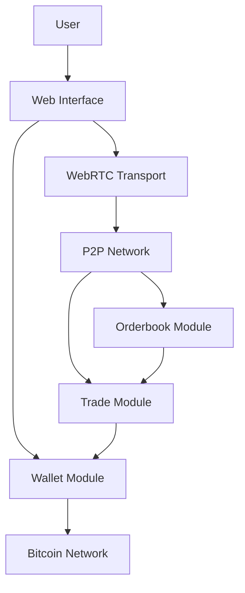
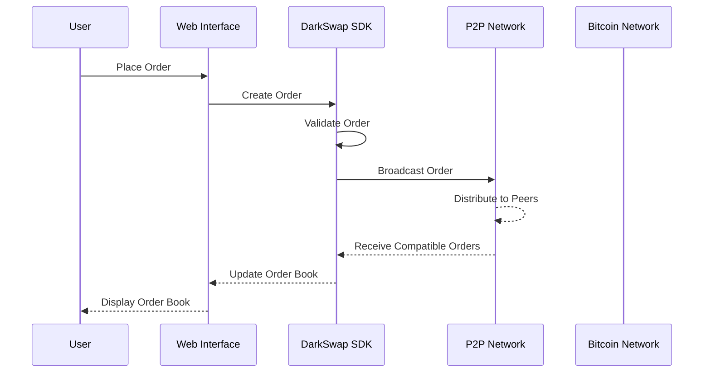
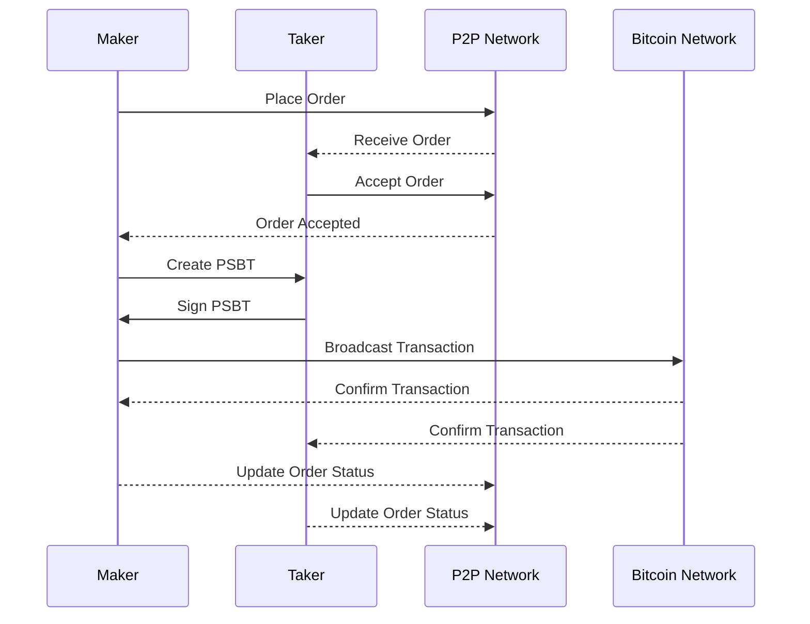

# DarkSwap Architecture

This document provides a comprehensive overview of the DarkSwap architecture, including its components, interactions, and design decisions.

## Table of Contents

- [System Overview](#system-overview)
- [Core Components](#core-components)
- [Data Flow](#data-flow)
- [Communication Protocols](#communication-protocols)
- [Security Model](#security-model)
- [Scalability Considerations](#scalability-considerations)
- [Development Guidelines](#development-guidelines)

## System Overview

DarkSwap is a decentralized exchange (DEX) for trading Bitcoin, Runes, and Alkanes. It uses a peer-to-peer network architecture with WebRTC for direct browser-to-browser communication, enabling trustless trading without intermediaries.

### High-Level Architecture

### Key Design Principles

1. **Decentralization**: No central server or authority controls the exchange
2. **Privacy**: Minimal data collection and no KYC requirements
3. **Security**: Non-custodial trading with atomic swaps
4. **Usability**: Simple and intuitive user interface
5. **Performance**: Optimized for speed and efficiency
6. **Extensibility**: Modular design for easy addition of new features

## Core Components

DarkSwap consists of several core components, each with a specific responsibility:

### Web Interface

The web interface is built with React and TypeScript, providing a user-friendly way to interact with the DarkSwap protocol. It includes:

- Trading interface with order book and charts
- Wallet management
- Order management
- Settings and preferences

### SDK

The DarkSwap SDK is a Rust library that provides the core functionality of the platform. It can be compiled to WebAssembly for use in the browser or used directly in Rust applications. The SDK includes:

- P2P networking
- Orderbook management
- Trade execution
- Wallet integration

### P2P Network

The P2P network enables direct communication between users without a central server. It uses:

- WebRTC for browser-to-browser communication
- Circuit relay for NAT traversal
- GossipSub for orderbook distribution

### Wallet Module

The wallet module manages the user's Bitcoin, Runes, and Alkanes. It supports:

- Multiple wallet types (built-in, external)
- Transaction signing
- Balance management
- PSBT (Partially Signed Bitcoin Transaction) creation and processing

### Orderbook Module

The orderbook module manages buy and sell orders. It includes:

- Order creation and validation
- Order matching
- Order distribution across the P2P network
- Order expiry management

### Trade Module

The trade module handles the execution of trades between users. It includes:

- Atomic swap protocol implementation
- Trade validation
- Trade status tracking
- Trade history management

## Data Flow

The data flow in DarkSwap follows these general steps:

1. **User Interaction**: User interacts with the web interface to place an order or execute a trade
2. **Local Processing**: The SDK processes the request locally
3. **P2P Communication**: The request is broadcast to the P2P network
4. **Order Matching**: Orders are matched with compatible counterparties
5. **Trade Execution**: Matched orders result in trade execution via atomic swaps
6. **Transaction Broadcast**: Completed transactions are broadcast to the Bitcoin network
7. **Status Update**: Trade status is updated and displayed to the user

### Order Flow

### Trade Flow

## Communication Protocols

DarkSwap uses several communication protocols:

### WebRTC

WebRTC (Web Real-Time Communication) enables direct browser-to-browser communication without requiring plugins or native apps. DarkSwap uses WebRTC for:

- Direct peer connections
- Data channels for order and trade communication
- NAT traversal with ICE (Interactive Connectivity Establishment)

### Circuit Relay

Circuit relay is used to facilitate connections between peers that cannot establish direct connections due to NAT or firewall restrictions. It works by:

1. Peer A connects to a relay node
2. Peer B connects to the same relay node
3. The relay node forwards messages between Peer A and Peer B

### GossipSub

GossipSub is a publish-subscribe protocol used for efficient message distribution across the P2P network. It is used for:

- Orderbook updates
- Trade announcements
- Network status updates

## Security Model

DarkSwap's security model is based on several key principles:

### Non-Custodial Trading

DarkSwap never takes custody of user funds. All trades are executed directly between users using atomic swaps, ensuring that funds are only transferred when both parties fulfill their obligations.

### Atomic Swaps

Atomic swaps ensure that either both parties receive their funds or neither does, eliminating counterparty risk. The implementation uses Bitcoin's native scripting capabilities to create transactions that:

1. Lock funds in a contract
2. Require both parties to sign to release the funds
3. Include timeouts to prevent funds from being locked indefinitely

### Peer Verification

Peers in the network verify each other's identities using cryptographic signatures. Each peer has a unique identifier derived from their public key, which is used to:

1. Sign messages
2. Verify message authenticity
3. Establish secure connections

### Data Privacy

DarkSwap minimizes the collection and sharing of user data:

1. Only necessary information is shared with trading partners
2. Communication is encrypted end-to-end
3. No personal information is required to use the platform

## Scalability Considerations

DarkSwap is designed to scale with increasing usage:

### Distributed Orderbook

The orderbook is distributed across all peers in the network, eliminating a central point of failure and allowing the system to scale horizontally as more users join.

### Efficient Message Propagation

GossipSub provides efficient message propagation across the network, reducing bandwidth requirements and ensuring that updates reach all peers quickly.

### Optimized WebAssembly

The SDK is compiled to WebAssembly for use in the browser, providing near-native performance while maintaining cross-platform compatibility.

### Lazy Loading and Code Splitting

The web interface uses lazy loading and code splitting to minimize initial load times and improve performance on low-bandwidth connections.

## Development Guidelines

### Code Organization

The DarkSwap codebase is organized into several repositories:

- `darkswap-sdk`: Core SDK written in Rust
- `darkswap-web`: Web interface written in TypeScript and React
- `darkswap-cli`: Command-line interface written in Rust
- `darkswap-daemon`: Background service written in Rust
- `darkswap-docs`: Documentation and specifications

### Coding Standards

- **Rust**: Follow the [Rust API Guidelines](https://rust-lang.github.io/api-guidelines/)
- **TypeScript**: Follow the [TypeScript Style Guide](https://google.github.io/styleguide/tsguide.html)
- **React**: Follow the [React Style Guide](https://reactjs.org/docs/code-style.html)

### Testing Strategy

- **Unit Tests**: Test individual components in isolation
- **Integration Tests**: Test interactions between components
- **End-to-End Tests**: Test complete workflows from the user's perspective
- **Property-Based Tests**: Test invariants and properties of the system

### Continuous Integration

- Automated testing on every pull request
- Code coverage reporting
- Static analysis and linting
- Performance benchmarking

### Release Process

1. Feature development in feature branches
2. Code review and approval
3. Merge to develop branch
4. Testing in staging environment
5. Release candidate creation
6. Final testing
7. Merge to main branch
8. Version tagging
9. Release to production

### Documentation

- API documentation generated from code comments
- Architecture documentation maintained in Markdown
- User guides and tutorials
- Developer guides and examples

### Contribution Guidelines

- Fork the repository
- Create a feature branch
- Make changes
- Write tests
- Submit a pull request
- Code review and approval
- Merge to develop branch

## Conclusion

The DarkSwap architecture is designed to provide a secure, private, and efficient platform for trading Bitcoin, Runes, and Alkanes. Its decentralized nature eliminates the need for intermediaries, while its modular design allows for easy extension and maintenance.

For more detailed information about specific components, please refer to the respective documentation:

- [SDK Documentation](../api/sdk.md)
- [P2P Network Documentation](../api/p2p.md)
- [Wallet Integration Guide](../guides/wallet-integration.md)
- [Trade Protocol Specification](../api/trade-protocol.md)